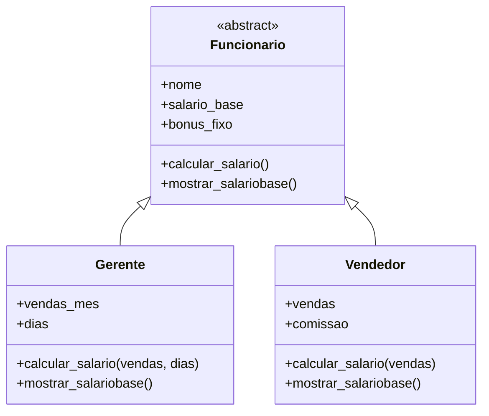

# 💼 Sistema de Cálculo de Salários — POO em Python


Um sistema simples de folha de pagamento que calcula o salário de diferentes tipos de funcionário (**Gerente** e **Vendedor**), cada um com sua própria regra de bônus/comissão. O projeto foi construído para praticar os quatro pilares da Programação Orientada a Objetos: **herança, abstração, encapsulamento e polimorfismo**.

---

## 🧠 Sobre o projeto

Toda empresa precisa calcular salários de formas diferentes dependendo do cargo. Este projeto modela esse problema usando uma classe abstrata `Funcionario` como contrato comum, e duas subclasses (`Gerente` e `Vendedor`) que implementam sua própria lógica de cálculo — sem duplicar código e sem `if/elif` gigantes para saber "que tipo de funcionário é esse".

## ⚙️ Funcionalidades

- 🧾 Cálculo automático do salário do **Gerente**, com bônus escalonado conforme o volume de vendas do mês
- 💰 Cálculo automático do salário do **Vendedor**, com comissão escalonada conforme o total de vendas
- 🖥️ Exibição formatada do salário final no terminal (usando a biblioteca `rich`)
- 🧩 Estrutura extensível: adicionar um novo tipo de funcionário é só criar uma nova subclasse

## 🛠️ Tecnologias utilizadas

| Tecnologia | Uso no projeto |
|---|---|
| **Python 3** | Linguagem principal |
| **abc (Abstract Base Classes)** | Define `Funcionario` como classe-base abstrata |
| **rich** | Formatação de saída no terminal |

## 🏗️ Estrutura de classes



**Regras de negócio implementadas:**

**Gerente** — bônus conforme vendas do mês:
| Vendas do mês | Bônus |
|---|---|
| R$ 0 – R$ 5.000 | R$ 0 |
| R$ 5.001 – R$ 20.000 | R$ 1.000 |
| Acima de R$ 20.000 | R$ 2.000 |

**Vendedor** — comissão conforme total de vendas:
| Vendas | Comissão |
|---|---|
| 0 – 500 | R$ 10 |
| 500 – 1.000 | R$ 25 |
| Acima de 1.000 | R$ 200 |

## ▶️ Como executar

```bash
# 1. Clone o repositório
git clone https://github.com/leticiamoraeszy/nome-do-repositorio.git
cd nome-do-repositorio

# 2. (Opcional, mas recomendado) crie um ambiente virtual
python -m venv venv
source venv/bin/activate      # Linux/Mac
venv\Scripts\activate         # Windows

# 3. Instale a dependência
pip install rich

# 4. Execute
python main.py
```

## 💻 Exemplo de saída

```
----SALÁRIO BASE----
salário base de Luiz é de 51600

----SALÁRIO BASE----
salário base de João é de 1210
```

## 🎯 Conceitos de POO aplicados

- **Abstração** — `Funcionario` define o contrato (`calcular_salario`, `mostrar_salariobase`) que toda subclasse deve seguir
- **Herança** — `Gerente` e `Vendedor` reaproveitam os atributos `nome` e `salario_base` da classe-base
- **Polimorfismo** — cada subclasse implementa `calcular_salario` com sua própria assinatura e regra de negócio
- **Encapsulamento** — a lógica de bônus/comissão fica isolada dentro da classe responsável por ela

## 📈 Possíveis melhorias futuras

- [ ] Usar `@abstractmethod` para forçar a implementação dos métodos nas subclasses
- [ ] Validar entradas negativas ou inválidas (ex.: vendas < 0)
- [ ] Formatar valores monetários (ex.: `R$ 51.600,00`)
- [ ] Adicionar o `bonus_fixo` do Gerente ao cálculo final do salário
- [ ] Escrever testes automatizados com `pytest`
- [ ] Persistir os dados em arquivo JSON ou banco de dados
- [ ] Criar uma interface de linha de comando (CLI) interativa para inserir os dados

## 👩‍💻 Autora

**Letícia** — desenvolvedora backend em formação, focada em Python
📎 GitHub: [@leticiamoraeszy](https://github.com/leticiamoraeszy)
✉️ Contato: leticiasantossmoraes@gmail.com

---

<p align="center"><i>Projeto de estudo — parte da minha jornada rumo a uma vaga Junior/Trainee em desenvolvimento backend.</i></p>
